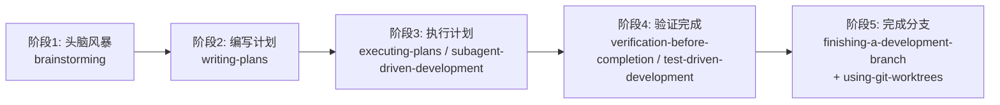
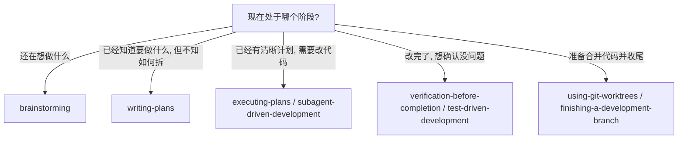

# 使用Superpowers自动开发需求规范指导

> 面向日常使用 Cursor / Superpowers 的开发者，帮助你把「一句话想法」稳定收敛为「可执行、可验收的规范需求」，并通过一套标准流程交给 AI 自动开发。

## 1. 引言

### 1.1 Superpowers 是什么

- **Superpowers**：一套围绕「技能（skills）」构建的 AI 开发工作流体系。  
- 核心思想：把“和 AI 聊天”升级为“调用一组可复用的技能”，让开发过程像使用一套专业工具链，而不是随缘对话。
- 在这个体系里，**每个技能都是一个可复用的小流程**，负责解决开发链路上的某一类问题（如头脑风暴、写计划、执行计划、管理 Git 分支、验证结果等）。

### 1.2 为什么使用 Superpowers

- **从「一次性对话」升级到「标准化流程」**：避免每次都从零想 Prompt，把经验沉淀到技能里。
- **降低沟通成本**：统一用同一套技能和术语，让人和 AI、团队成员之间可以复用同一套心智模型。
- **提高可控性**：通过「先计划后执行」「先验证再合并」等硬约束，降低 AI 胡乱改代码、引入隐性 BUG 的风险。
- **增强可追踪性**：每一步都有对应技能、产物和检查点，方便复盘和复用。

### 1.3 适用场景

- 开发日常需求：新增功能、补充接口、改动小模块。
- 维护和修复：修 Bug、补测试、对线上问题做回溯和修复。
- 渐进式重构：把「想大改」拆成若干小步，每一步都可被验证和回滚。
- 知识沉淀：把一次性的「好 Prompt」「好方案」整理为可重复使用的技能和模板。

### 1.4 核心价值

- **稳定性**：同一类需求，经过同一套技能和流程，产出的质量更稳定。
- **效率**：最大化让 Superpowers 替你干「机械但繁琐」的部分（生成需求、写计划、跑重复步骤），你只做判断和关键决策。
- **可协作**：团队成员可以共享同一套流程（例如「先 brainstorming 再 writing-plans」），减少个体风格差异带来的混乱。
- **可演进**：基于技能的方式，允许你在不推翻整体体系的前提下，逐步升级每个技能的实现细节。

---

## 2. 核心原则

### 2.1 技能优先规则

- **能用 skill，就不用自由对话。**
- 优先从「我现在在做哪一步？」的角度选择技能，而不是「我想说点什么」：
  - 在想需求 → 用 `brainstorming`；
  - 在设计方案 → 用 `writing-plans`；
  - 在执行变更 → 用 `executing-plans` / `subagent-driven-development`；
  - 在收尾和合并 → 用 `finishing-a-development-branch`。
- 如果不得不用自由对话（如解释背景、临时确认），也要：
  - 尽量简洁；
  - 用对词汇（和技能描述里的概念保持一致）；
  - 对重要结论，再回到相应技能里进行「结构化沉淀」。

### 2.2 1% 原则

- **任何一步，如果你觉得「有 1% 不确定」，就不要直接让 AI 自由发挥。**
- 具体体现在：
  - 方案不确定 → 不要让 AI 直接写代码，先用 `brainstorming` 拉出备选方案，再通过对话收敛。
  - 需求不完整 → 不要「先写一版再说」，而是补足「输入边界、约束条件、验收标准」。
  - 影响范围不清楚 → 不要一次性大改，先拆分为小步，并用 `writing-plans` 明确每一步影响的文件和接口。
- 1% 原则的目标：**用一点点额外的前期思考，避免后面 90% 的返工。**

### 2.3 技能优先级

优先级从高到低可以理解为：

1. **`using-superpowers` 顶层规则**  
   - 定义整体协作模式、目标和边界。
2. **流程类技能**（先后顺序强）：  
   - `brainstorming` → `writing-plans` → `executing-plans` → `verification-before-completion` → `finishing-a-development-branch`。
3. **支撑类技能**（在特定节点调用）：  
   - `using-git-worktrees`、`test-driven-development`、`subagent-driven-development`。
4. **自由对话**（兜底）：  
   - 用于解释业务背景、提供截图、粘贴错误日志等。

> 当技能和自由对话的建议冲突时，**以技能描述为准**，必要时调整 Prompt，让行为重新对齐技能规则。

### 2.4 红旗警示

以下情况出现任意一条，视为「红旗」，需要你立即介入人工判断：

- 需求描述里出现大量「大概」「差不多」「你看着办」之类模糊表述；
- 计划里存在「重构整个模块」「全局搜索替换」一类大范围操作，但没有清晰的分步策略；
- `executing-plans` 的执行结果明显超出了原先计划的范围（多改了文件、多做了重构）；
- 验证环节只做了「跑一下测试」而没有明确的 **验收用例/测试点**；
- Git 分支缺乏隔离，直接在主分支上做大规模修改；
- 为了图快频繁跳过 `brainstorming` 和 `writing-plans`，直接让 AI 写代码。

处理方式：

- 立即停止当轮自动执行；
- 回到对应阶段的技能（多半是 `brainstorming` 或 `writing-plans`）重新梳理；
- 明确当前需求的输入 / 输出 / 验收标准，再继续后续技能。

---

## 3. 完整工作流程

### 3.1 流程概览图

整体原则：

- 在每个阶段，都尽量用对应的技能完成该阶段工作；
- 上一阶段的产物，作为下一阶段的「唯一真实来源」（source of truth）；
- 任意阶段发现信息不足或风险过高，都可以「回退」到上一阶段重做。

### 3.2 阶段1：头脑风暴（探索需求）

目标：

- 从模糊想法出发，澄清需求边界与目标；
- 拉出多个备选方案 / 设计思路，而不是直接锁定一条路径。

关键动作：

- 使用 `brainstorming`，告诉 AI：
  - 当前背景（业务上下文、已有系统）；
  - 想解决的问题（痛点或目标）；
  - 已知约束（技术栈、兼容性、时间等）；
- 要求输出：
  - 多个备选方案（优缺点对比）；
  - 关键设计决策点（例如：是否拆表、是否拆服务、是否引入缓存）。

输出物：

- 一份结构化的方案对比列表 + 明确的推荐方案；
- 后续 `writing-plans` 会以此为基础，展开具体实现计划。

### 3.3 阶段2：编写计划（设计方案）

目标：

- 把「选定的方案」拆解为可执行的开发计划；
- 明确每一步要改哪些文件、增加哪些接口、怎样回滚。

关键动作：

- 使用 `writing-plans`，输入：
  - 选定方案的简要描述；
  - 代码仓库当前状态的要点（关键模块、技术栈）；
  - 对计划的约束（如「每一步修改不超过 N 个文件」「保持测试可跑」）。
- 要求输出：
  - 按步骤拆解的开发计划（通常 3–10 步）；
  - 每一步包含：
    - 要修改/新增的文件列表；
    - 预期行为变更；
    - 需要补充的测试或验证方式。

输出物：

- 一份清晰的计划文档，将作为 `executing-plans` / `subagent-driven-development` 的输入。

### 3.4 阶段3：执行计划（实现功能）

目标：

- 按计划逐步修改代码，确保每一步都有清晰意图和可回滚性。

关键动作：

- 使用 `executing-plans`：
  - 逐步执行 `writing-plans` 产出的计划；
  - 每完成一小步，就进行一次自检（如：静态检查、基本运行验证）。
- 对较大或复杂需求，可以使用 `subagent-driven-development`：
  - 把大计划拆分成多个子计划；
  - 交由子代理并行或轮流完成各自部分；
  - 最终在主代理处汇总和整合。

输出物：

- 一组已经在本地（或工作树）中修改完成、可运行的代码变更；
- 每一步都有对应的变更记录和执行结果说明。

### 3.5 阶段4：验证完成（确保质量）

目标：

- 确保本轮变更满足需求、未引入明显回归。

关键动作：

- 使用 `verification-before-completion`：
  - 基于初始需求 + 计划内容，列出必须通过的验收点；
  - 对每个验收点执行对应的检查（单测、接口测试、手工验证等）；
  - 对结果进行记录（通过 / 有问题）。
- 对强调「先测后实现」的场景，结合 `test-driven-development`：
  - 在编码前先确定测试用例；
  - 用技能辅助生成或完善测试代码；
  - 确保实现阶段以「红-绿-重构」节奏推进。

输出物：

- 一份包含验收用例、测试结果和遗留问题的验证报告；
- 若发现问题，回到阶段 2 或 3 修正后重新验证。

### 3.6 阶段5：完成分支（集成工作）

目标：

- 把本次变更安全地集成到主干或上游分支，并清理临时环境。

关键动作：

- 使用 `using-git-worktrees` 管理独立工作树：
  - 每个需求对应一条独立的工作分支 + 工作树；
  - 在该工作树中完成所有开发和验证；
  - 集成完成后再清理。
- 使用 `finishing-a-development-branch`：
  - 确认当前分支状态（代码、测试、文档是否齐备）；
  - 根据团队流程选择：直接合并 / 提交 PR / rebase 等；
  - 完成后清理无用分支和工作树。

输出物：

- 已合并到主干（或目标分支）的变更；
- 本轮需求的分支和工作树被安全清理。

---

## 4. 各个技能详解

### 4.1 `using-superpowers`：基础规则

作用：

- 定义「人类 & Superpowers」之间的协作契约；
- 统一诸如「如何选择技能」「如何反馈结果」「如何处理不确定性」等元规则。

建议规范：

- 在每次较大的开发任务前，简要重申当前任务的：
  - 目标（Goal）；
  - 约束（Constraints）；
  - 成功标准（Definition of Done）。
- 要求 AI：
  - 主动建议合适的技能，而不是被动等待指令；
  - 在不确定时明确提出，而不是「自作主张」；
  - 所有重要决策点都输出备选方案 + 理由。

### 4.2 `brainstorming`：需求探索

作用：

- 帮助你把模糊需求彻底「摊开」，看到多个可能路径与隐含问题。

典型用法：

- 输入：
  - 业务背景 + 现有系统简述；
  - 想要达成的目标（可以模糊，但最好有示例）；
  - 任何你已经想到但不确定的想法。
- 输出期望：
  - 多个方案（含优缺点）；
  - 关键风险点和依赖前提；
  - 推荐下一步如何收敛（例如「建议先缩小范围，从子问题 X 开始」）。

### 4.3 `writing-plans`：计划编写

作用：

- 把「选定方案」转化为一系列有顺序、可执行的小步骤。

典型用法：

- 输入：
  - 最终选定的方案（可以引用 `brainstorming` 的结论）；
  - 仓库结构和关键模块简介；
  - 对计划的约束（例如「每一步可在 30 分钟内完成和验证」）。
- 输出期望：
  - 步骤化的开发计划（Step 1/2/3…）；
  - 每一步要动的文件和函数；
  - 每一步结束后需要检查 / 运行的内容。

### 4.4 `using-git-worktrees`：工作树管理

作用：

- 为不同需求创建隔离的工作空间，避免在主工作目录里堆积一堆未完成的改动。

典型用法：

- 在新需求开始前：
  - 使用该技能生成或校验工作树创建命令；
  - 按约定命名分支和目录；
  - 确认如何在不同工作树间切换和清理。
- 在需求完成后：
  - 回顾当前工作树状态；
  - 根据技能建议安全清理工作树和关联分支。

### 4.5 `executing-plans`：批量执行

作用：

- 按照 `writing-plans` 输出的计划，逐步实际修改代码。

典型用法：

- 输入：
  - 完整的开发计划；
  - 当前代码状态（包括前一步已经完成的部分）。
- 过程约束：
  - 每执行完一个步骤，就同步回报：
    - 实际修改了哪些文件；
    - 有没有和计划不一致的地方；
    - 相关检查是否通过。

### 4.6 `subagent-driven-development`：子代理开发

作用：

- 在大的需求中引入「多个专长不同的子代理」，分别负责子任务，提高整体效率和质量。

典型用法：

- 把整体需求拆分为若干子范围（如：后端接口、前端 UI、测试代码、文档）。
- 使用该技能：
  - 为不同子范围创建独立上下文；
  - 指定每个子代理的职责和边界；
  - 在主代理处做最终整合和冲突解决。

### 4.7 `test-driven-development`：测试驱动

作用：

- 把「先写测试，再写实现」的最佳实践固化到 Superpowers 的工作流中。

典型用法：

- 在执行阶段前：
  - 明确本次需求的关键行为；
  - 让技能帮助补齐或生成对应测试；
  - 确认哪些测试会先失败（红灯），作为后续实现的目标。

### 4.8 `verification-before-completion`：验证机制

作用：

- 在「准备完成本轮开发」前，再做一次系统性检查，避免「以为已经 OK 了」。

典型用法：

- 输入：
  - 初始需求描述；
  - 已执行的计划列表；
  - 当前测试 / 验证结果。
- 输出期望：
  - 必须通过的验收项清单；
  - 每一项的验证结果；
  - 若存在剩余风险，给出是否可以接受、如何在后续任务中处理的建议。

### 4.9 `finishing-a-development-branch`：分支完成

作用：

- 规范地结束一次开发分支（或工作树），并把成果安全合入主线。

典型用法：

- 使用该技能：
  - 检查当前分支是否还有未提交变更；
  - 确认测试和验证是否全部完成；
  - 生成合并策略建议（如：squash merge / rebase / 普通 merge）；
  - 完成后清理本地多余分支和工作树。

---

## 5. 实战案例

### 5.1 案例1：开发新功能

场景示例：

- 需求：为现有接口增加一个可选过滤条件，并在前端展示过滤结果。

推荐流程：

1. 使用 `brainstorming`：
   - 讨论不同的接口设计方式（新增参数 / 新增接口 / 通过查询参数扩展等）；
   - 评估向后兼容性和性能影响。
2. 使用 `writing-plans`：
   - 拆解为「后端改动」「前端改动」「测试补充」三个部分；
   - 每部分再细分 2–3 个可独立完成的小步骤。
3. 使用 `using-git-worktrees`：
   - 为此次功能创建独立工作树和分支。
4. 使用 `executing-plans` / `subagent-driven-development`：
   - 按计划逐步实现后端 + 前端；
   - 若前后端由不同子代理负责，可并行推进。
5. 使用 `test-driven-development` + `verification-before-completion`：
   - 补齐关键路径测试；
   - 执行完整验收清单。
6. 使用 `finishing-a-development-branch`：
   - 合并至主干；
   - 清理工作树。

### 5.2 案例2：修复 Bug

场景示例：

- 需求：某个接口在边界条件下返回错误结果。

推荐流程：

1. `brainstorming`：
   - 让 AI 帮忙梳理可能的成因（例如：空值处理、时区问题、并发条件等）；
   - 列出需要检查的代码位置和日志线索。
2. `writing-plans`：
   - 拆分为「复现问题」「定位原因」「修复实现」「补充测试」四步；
   - 对每一步设定明确的完成标准。
3. `executing-plans`：
   - 严格按照计划修改代码，避免为修一个 Bug 而顺手做一堆重构。
4. `test-driven-development`：
   - 先写失败用例，确认问题确实存在；
   - 修复后让用例通过，防止未来回归。
5. `verification-before-completion`：
   - 确认是否对其他行为有影响；
   - 必要时建议增加回归测试。

### 5.3 案例3：重构代码

场景示例：

- 需求：把一个「巨型函数」拆分为可维护的若干小函数，并保持行为不变。

推荐流程：

1. `brainstorming`：
   - 讨论不同的拆分策略（按业务步骤、按数据结构、按异常路径等）；
   - 评估重构范围和风险。
2. `writing-plans`：
   - 拆为若干小步，每一步都保证可以独立提交与回滚；
   - 明确哪些步骤只做重构、不改变外部行为。
3. `test-driven-development`：
   - 先补足当前行为的覆盖测试，确保「重构前是绿灯」；
   - 在整个重构过程中持续跑测试，保证行为不变。
4. `executing-plans` + `subagent-driven-development`：
   - 条件允许时，把不同子模块重构工作交给不同子代理；
   - 主代理负责统一风格和最终整合。
5. `verification-before-completion` + `finishing-a-development-branch`：
   - 确认重构没有引入新问题；
   - 整理提交历史，合并入主干。

---

## 6. 最佳实践

### 6.1 何时使用哪个技能

- **不确定做什么 → `brainstorming`**  
- **知道要做什么，但不知怎么拆 → `writing-plans`**  
- **计划已经清晰，需要写代码 → `executing-plans` / `subagent-driven-development`**  
- **想确保质量达标 → `test-driven-development` + `verification-before-completion`**  
- **需要干净的分支管理 → `using-git-worktrees` + `finishing-a-development-branch`**  
- **跨整个生命周期的元规则 → `using-superpowers`**

### 6.2 常见错误及避免方法

- 错误：直接让 AI「帮我改一下这个文件」。  
  - 正确做法：先用 `brainstorming` 和 `writing-plans` 明确改动范围和目标。
- 错误：在一个分支里同时处理多个无关需求。  
  - 正确做法：为每个需求创建独立工作树和分支。
- 错误：跳过验证，凭肉眼觉得「大概没问题」。  
  - 正确做法：用 `verification-before-completion` 明确列出必须验证的点，并逐条打勾。

### 6.3 效率优化技巧

- **模板化输入**：为 `brainstorming` 和 `writing-plans` 准备复用的输入模板（包含背景、目标、约束、已有实现等）。
- **分批执行**：对于大型需求，一次只执行计划中的 1–3 步，完成后再继续下一批。
- **及时沉淀**：当某次合作特别顺利时，把当次使用的技能组合和 Prompt 保存下来，下次直接复用。

### 6.4 团队协作建议

- 为团队约定统一的：
  - 技能使用顺序（例如「所有新功能必须先走 `brainstorming` + `writing-plans`」）；
  - 提交信息格式（如在 commit message 中引用需求 ID 和技能步骤）；
  - 验收 checklist（由 `verification-before-completion` 统一产出）。
- 为新人准备：
  - 一份「技能如何选用」的速查表；
  - 若干「从需求到合并」的完整示例会话。

---

## 7. 快速参考指南

### 7.1 技能选择决策树

### 7.2 常用命令速查（示意）

- **创建新需求工作树**：通过 `using-git-worktrees` 获取推荐命令和命名规范。  
- **开始一个新需求会话**：用 `using-superpowers` 明确目标、范围和成功标准。  
- **发起头脑风暴**：调用 `brainstorming`，提供背景 + 目标 + 约束。  
- **生成开发计划**：调用 `writing-plans`，输入选定方案和仓库结构要点。  
- **按计划执行**：调用 `executing-plans` 或 `subagent-driven-development`，逐步落实改动。  
- **开发完成前验证**：调用 `verification-before-completion`（必要时结合 `test-driven-development`）。  
- **合并并收尾**：调用 `finishing-a-development-branch`，完成集成和清理工作树。

### 7.3 Checklist 大全（示例）

- **开始新需求前**：
  - [ ] 目标是否清晰、可度量？
  - [ ] 是否已经通过 `brainstorming` 探索过方案？
  - [ ] 是否创建了独立分支 / 工作树？
- **执行开发计划时**：
  - [ ] 每一步是否都对应计划中的某一条？
  - [ ] 是否避免在执行过程中随意增加不在计划中的「顺手改动」？
  - [ ] 每一小步是否都完成了基本验证？
- **准备合并前**：
  - [ ] 所有计划中的步骤是否都已经完成或有合理的延期说明？
  - [ ] 关键路径测试是否全部通过？
  - [ ] 是否通过 `verification-before-completion` 完成最终验收？

### 7.4 流程图汇总

建议在你的知识库或团队 Wiki 中，保存以下图表的快照：

- 整体工作流总览图（见 3.1）；  
- 技能选择决策树（见 7.1）；  
- 围绕 Git 工作树和分支管理的流程图（可基于 `using-git-worktrees` 和 `finishing-a-development-branch` 进一步细化）。

---

## 8. 附录

### 8.1 相关资源

- Superpowers / Cursor 官方文档与指南；
- 团队内部约定的技能使用规范与案例库；
- 典型项目中的「从需求到合并」完整对话记录（可做教学示例）。

### 8.2 常见问题（FAQ）

- **Q：什么时候可以不按完整流程来？**  
  - A：极小、低风险、一次性的小改动（例如文案修改）可以只用部分技能，但**不建议**对任何会影响行为的改动跳过 `writing-plans` 和 `verification-before-completion`。

- **Q：自由对话还重要吗？**  
  - A：重要，但更多用于补充上下文和澄清问题。真正关键的决策和流程，应该通过技能产物沉淀下来。

- **Q：如果技能的建议和我的直觉冲突怎么办？**  
  - A：先通过自由对话说明你的考虑，再用 `brainstorming` / `writing-plans` 把新的思路转化为结构化输出，避免只停留在「感觉」层面。

- **Q：团队成员风格不同，使用技能方式也不同怎么办？**  
  - A：以本文为基础，逐步收集并固化「本团队的 Superpowers 使用规范」，形成共识和统一模板，让差异主要体现在判断力和经验上，而不是流程本身。

