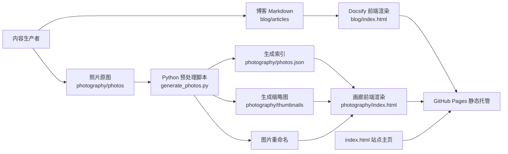

# 架构设计

## 1. 项目定位

本项目是一个基于 GitHub Pages 的个人站点，包含两个核心子系统：

- 博客系统（`/blog`）：使用 Docsify 渲染 Markdown 内容。
- 摄影系统（`/photography`）：前端展示 + Python 脚本离线生成图片索引与缩略图。

整体采用“静态托管 + 本地内容生产”的架构模式：运行期无后端服务，所有动态能力在发布前通过脚本预处理完成。

## 2. 架构目标

- **低运维成本**：无需服务器，仅依赖静态托管。
- **内容可持续生产**：新增文章与照片流程简单、可重复。
- **访问性能可控**：通过缩略图与静态资源直出提升加载速度。
- **可演进性**：后续可无缝扩展自动化发布、搜索、CDN 优化等能力。

## 3. 总体架构

## 4. 分层设计

### 4.1 展示层（Frontend）

- `index.html`：站点首页导航（博客入口 + 摄影入口）。
- `blog/index.html`：Docsify 容器页，负责加载 Markdown、侧边栏、搜索与分页插件。
- `photography/index.html`：画廊页面，运行时读取 `photos.json`，按卡片流布局渲染，并支持点击查看原图。

特征：

- 纯静态资源（HTML/CSS/JS）。
- 运行时无数据库访问。
- 运行时“动态”来自静态 JSON 的加载。

### 4.2 内容层（Content）

- 博客内容：`blog/README.md`、`blog/_sidebar.md`、`blog/articles/*.md`。
- 摄影内容：`photography/photos/*`（原图）、`photography/thumbnails/*`（缩略图）、`photography/photos.json`（索引）。

### 4.3 生产层（Build/Generate）

- `generate_photos.py` 负责离线预处理：
  - 读取 EXIF 拍摄时间（若缺失则回退文件修改时间）。
  - 读取 GPS 并可通过 `geopy + Nominatim` 逆地理编码地点。
  - 统一重命名为 `地点_YYMMDD_HHMMSS` 格式。
  - 生成缩略图（含 EXIF 方向修正）。
  - 输出前端消费的 `photos.json`。

该脚本是摄影子系统的“数据生产管道”。

### 4.4 依赖层（Dependencies）

- Python：`Pillow`、`geopy`（见 `requirements.txt`）。
- 前端 CDN 依赖：Docsify、Prism、search/pagination/copy-code/zoom-image 等插件。
- 托管：GitHub Pages。

## 5. 核心流程

## 5.1 博客发布流程

1. 新增/修改 `blog/articles/*.md`。
2. 更新 `blog/_sidebar.md` 导航。
3. 提交并推送到仓库。
4. GitHub Pages 发布后，Docsify 在浏览器端按路由加载并渲染内容。

## 5.2 摄影发布流程

1. 将照片放入 `photography/photos/`。
2. 运行 `python generate_photos.py`。
3. 脚本完成重命名、缩略图生成、`photos.json` 更新。
4. 提交并推送到仓库。
5. `photography/index.html` 运行时读取 `photos.json`，展示缩略图，点击后加载原图。

## 6. 目录与职责

- `index.html`：主入口与导航。
- `blog/`：博客展示与内容文件。
- `photography/`：摄影页面、原图、缩略图、图片索引。
- `generate_photos.py`：摄影内容离线处理脚本。
- `requirements.txt`：Python 依赖定义。

## 7. 非功能设计

- **性能**
  - 摄影页优先加载缩略图，原图按点击需加载，降低首屏流量。
  - 使用浏览器原生懒加载（`img.loading = "lazy"`）。
- **可用性**
  - 当 `photos.json` 不可用时，前端有降级提示。
  - 移动端通过 CSS 媒体查询适配。
- **可维护性**
  - 内容与展示解耦：Markdown/JSON 与前端模板分离。
  - 自动化脚本集中处理命名规则和元数据提取，减少人工错误。

## 8. 风险与改进建议

- **外部服务依赖风险**：逆地理编码依赖 Nominatim 服务，可能受网络或限流影响。
  - 建议：保留离线回退策略（当前已支持）并持久化地理缓存文件。
- **图片规模增长风险**：照片数量增加后，`photos.json` 与列表渲染压力上升。
  - 建议：增加分页或分段索引（按年月拆分 JSON）。
- **CDN 依赖稳定性风险**：Docsify 与插件依赖公共 CDN。
  - 建议：关键脚本本地化或增加备用 CDN。

## 9. 演进路线（建议）

- 引入 GitHub Actions：在推送时自动执行图片处理脚本与校验。
- 为摄影系统增加标签/地点筛选与按时间归档。
- 为博客增加文章元信息规范（标题、日期、标签）与自动目录生成。
- 引入 Lighthouse 基线检测，持续优化前端性能与可访问性。

## 10. 结论

当前架构适合个人内容站点：简单、稳定、低成本。通过“静态页面 + 预处理脚本”实现了接近动态站点的内容更新体验，同时保留了 GitHub Pages 的部署优势。
